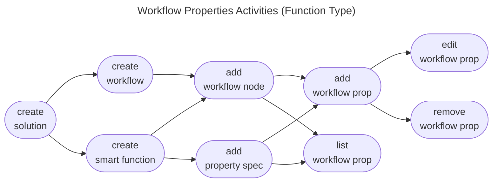
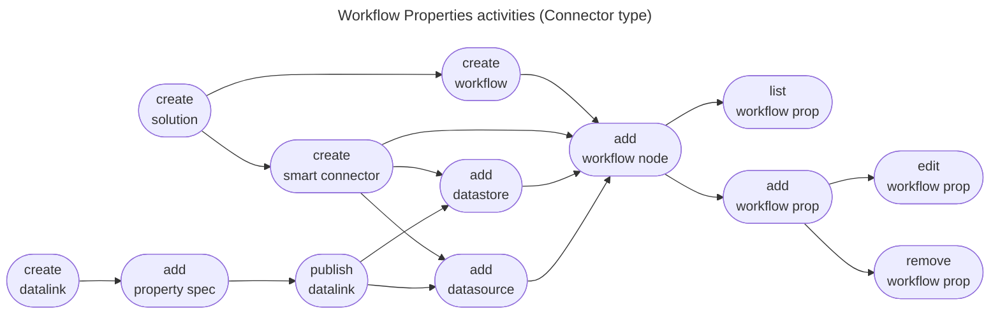

# Workflow Command Specs

The workflow command provides functionality for managing the strategies provided with a solution to an end user. A solution can expose multiple workflows to a user with the intent of grouping related work units together.

A solution, for instance, may need to gather user input before a proper sequence of work units can be invoked. 

* [Features](#features)
  * [Workflow Properties](#workflow-properties)
* [By Command](#commands)
* [By Test Cases](#test-cases)

## Features

### Workflow Properties

The workflow properties activity occurs when a developer wishes to override the default values specified by a Smart Function on a workflow node he added to a solution. It involves a series of use cases detailed under the [workflow node properties for an extensive workflow](../../features/workflow/props_extensive_workflow.feature) feature.

When the Smart Function added as a workflow node is of type **Connector**, the activities involve all datalink types defined as datasources or datastores on the Smart Function. The use cases are then extended to the [workflow node properties for a connector workflow](../../features/workflow/props_connector_workflow.feature) feature.

## Commands

* [create](create.md)
* [delete](delete.md)
* [links](links.md)
* [list](list.md)
* [nodes](nodes.md)
* [prop](prop.md)

## Test Cases

* [Create simple workflow](../../features/workflow/create_simple_workflow.feature)
* [Delete simple workflow](../../features/workflow/delete_simple_workflow.feature)
* [Links extensive workflow](../../features/workflow/links_extensive_workflow.feature)
* [List account workflows](../../features/workflow/list_account_workflows.feature)
* [List local workflows](../../features/workflow/list_local_workflows.feature)
* [Nodes extensive workflow](../../features/workflow/nodes_extensive_workflow.feature)
* [Props extensive workflow](../../features/workflow/props_extensive_workflow.feature)
