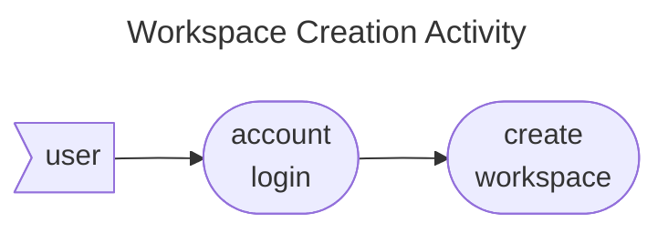
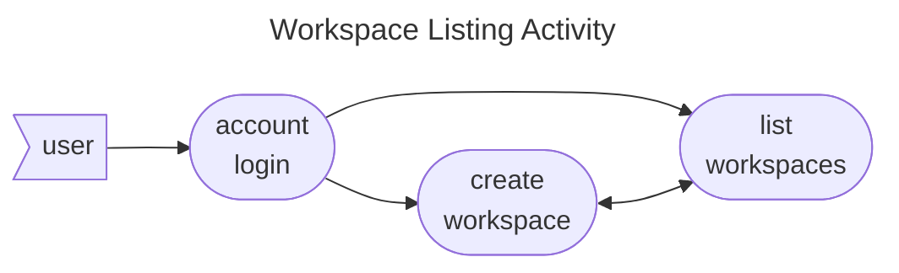

# Workspace Command Specs

The workspace command provides functionality for creating and managing workspaces provided by a Broker on a specific
account. A workspace can expose multiple Workflows from many Solutions. It provides the environment for being able to
invoke a Workflow on a groups of Agents managed by the Broker.

* [Features](#features)
    * [Workspace Creation](#workspace-creation)
    * [Workspace Listing](#workspace-listing)
* [By Command](#commands)
* [By Test Cases](#test-cases)

## Features

### Workspace Creation

The workspace creation activity is a simple user to broker request which returns a workspace resource with its creation
date and workspace id. It involves a series of scenarios detailed
under [create simple workspace](../../features/workspace/create_simple_workspace.feature).

### Workspace Listing

The workspace listing activity is a simple user to broker request which returns the list of workspaces for an integer flag value representing Workspace status and type. It involves a series of scenarios detailed under [list simple use workspaces](../../features/workspace/list_simple_user_workspaces.feature)

## Commands

* [create](create.md)
* [list](list.md)

## Test Cases

* [Create Simple Workspace](../../features/workspace/create_simple_workspace.feature)
* [List Simple User Workspaces](../../features/workspace/list_simple_user_workspaces.feature)
