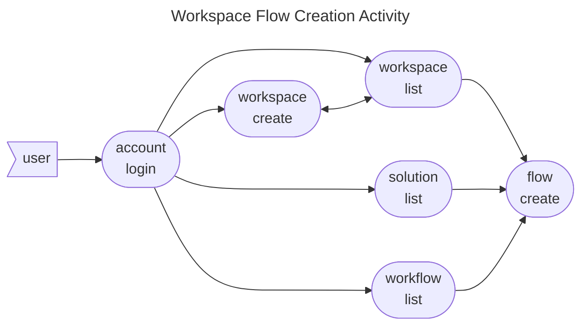
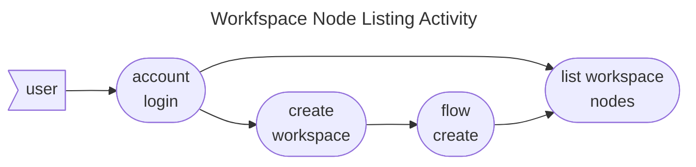

# Workspace Command Specs

The workspace command provides functionality for creating and managing workspaces provided by a Broker on a specific
account. A workspace can expose multiple Workflows from many Solutions. It provides the environment for being able to
invoke a Workflow on a groups of Agents managed by the Broker.

* [Features](#features)
    * [Workspace Creation](#workspace-creation)
    * [Workspace Flow Creation](#workspace-flow-creation)
    * [Workspace Listing](#workspace-listing)
    * [Workspace Node listing](#workspace-node-listing)
* [By Command](#commands)
* [By Test Cases](#test-cases)

## Features

### Workspace Creation

The workspace creation activity is a simple user to broker request which returns a workspace resource with its creation
date and workspace id. It involves a series of scenarios detailed
under [create simple workspace](../../features/workspace/create_simple_workspace.feature).

### Workspace Flow Creation

The Workspace Flow creation activity is a complex user to broker sequence of requests which serves as a starting point
for the deployment of Solution Workflow into an orchestrated Flow execution. It involves a series of scenarios detailed
under [create workspace flow](../../features/workspace/create_workspace_flow.feature)

### Workspace Listing

The workspace listing activity is a simple user to broker request which returns the list of workspaces for an integer
flag value representing Workspace status and type. It involves a series of scenarios detailed
under [list simple use workspaces](../../features/workspace/list_simple_user_workspaces.feature)

### Workspace Node Listing

Once a Workspace Flow has been created, the Orchestration assigns `Solution Workflow Nodes` to `Workspace Flow Nodes`.
These nodes are mirrored containers allowing the user to set configurations and parameters required by any Smart
Function to be executed when the `Solution Workflow` is executed.

Workspace Nodes always belong to a specific [Flow](#workspace-flow-creation). The scenario is detailed
under [list workspace nodes](../../features/workspace/list_workspace_nodes.feature).

## Commands

* [create](create.md)
* [flow](flow.md)
* [list](list.md)
* [node](node.md)

## Test Cases

* [Create Simple Workspace](../../features/workspace/create_simple_workspace.feature)
* [Create Workspace Flow](../../features/workspace/create_workspace_flow.feature)
* [List Simple User Workspaces](../../features/workspace/list_simple_user_workspaces.feature)
* [List Workspace Nodes](../../features/workspace/list_workspace_nodes.feature)
